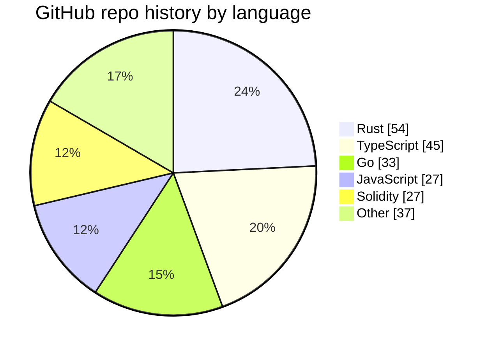

# Sam Powell

CEO @ [Vilano AI](https://vilano.ai)

I build software for the part most teams hand-wave away: memory, recovery, orchestration, governance, and operator control.

The common thread in my work is that I do not like systems that only look good on the happy path. I care about what happens when a worker dies mid-run, when state has to survive restarts, when automation needs authority boundaries, when a browser environment has to be convincing enough to fool hostile code, or when the operator needs to understand exactly why the machine did what it did.

If my GitHub history looks eclectic, that is because I like software where the constraints are real.

## Languages I've Actually Built In

_Roughly by primary language across my non-fork GitHub repos._

## The Kind Of Engineer I Am

I have spent serious time across runtime systems, distributed monitors, retrieval pipelines, market-facing low-latency tooling, browser and protocol sandboxes, cloud/dev infra, and agent execution layers. That mix sounds random until you look at the through-line: I keep gravitating toward systems that need explicit state, strong control loops, and a clean separation between what is automated, what is durable, and what still belongs to a human operator.

I am comfortable moving between product-speed languages and lower-level systems work. TypeScript is where I move fast on runtime surfaces and orchestration. Go is where I like to build clear service boundaries and concurrency-heavy control loops. Rust is where I want tighter control over execution, transport, and correctness. Zig is where I want small, sharp tools without much abstraction standing in the way. And the older repo history matters too: there is a long trail through Solidity security work, browser automation and anti-bot tooling, scraping and data acquisition systems, deployers and cloud scaffolds, plus the early Ruby, Python, C++, and Swift detours you only get by actually building a lot of different things over time.

## What I Tend To Build

### Durable execution systems

I like systems where work is replayable, state is durable, and retries are not the main strategy. Queues, leases, supervision, passivation, child execution, signals, pubsub, and inspectable timelines are much more interesting to me than another thin wrapper around background jobs.

### Agent infrastructure with real boundaries

I care about agents, but I care even more about the machinery around them. That means execution graphs, review loops, escalation paths, policy rails, and governance models that stop the system from pretending uncertainty is the same thing as autonomy.

### Retrieval and code intelligence

I am drawn to systems that turn large codebases into something queryable and grounded: multi-language parsing, graph and vector representations, citation-backed synthesis, confidence gates, and tooling that can explain where an answer came from instead of bluffing.

### Browser, protocol, and anti-abstraction work

Some of the most technically interesting work I have done has been below the application layer: reconstructing browser environments, shaping network behavior, dealing with TLS and HTTP quirks, and learning where "the script runs" is still very far away from "the environment behaves like the real thing."

### Low-latency and signal-to-action systems

I have also spent time in systems where timing, bad data, and execution quality all matter at once: ingesting live feeds, ranking and filtering signals, managing proxy-backed clients, and carrying the path all the way through to action.

### Data acquisition and ugly real-world interfaces

There is also a big thread in my repo history around crawling, scraping, public/business data, real-estate data, monitors, and all the brittle integration work that comes with systems built against interfaces that do not really want to be integrated with.

### Security and adversarial environments

Another consistent pattern is that I learn a lot by working close to hostile surfaces: smart contract attack exercises, anti-bot systems, CAPTCHA and browser-fingerprint work, transport quirks, and the kinds of environments where correctness is not enough unless the system is also believable.

## Current Focus

Right now, the clearest embodiment of how I think is [Vilano Runtime](https://github.com/vilano-ai/runtime).

It is a durable runtime for agent systems built around deterministic replay: the code reruns, the state does not. Underneath it is a BEAM kernel handling coordination, waits, signals, leases, supervision, passivation, and durable execution state. On top of that sit disposable TypeScript workers and an operator surface.

That is the kind of software I want more of: systems that keep their shape under failure and can still be understood once they are under load.

## Public Repos

- [vilano-ai/runtime](https://github.com/vilano-ai/runtime)
- [mcl0vinit/rove](https://github.com/mcl0vinit/rove)
