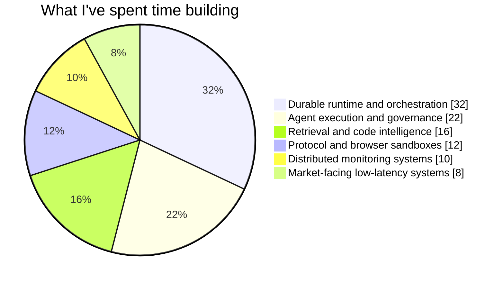

# Sam Powell

CEO @ [Vilano AI](https://vilano.ai)

I build infrastructure for agent systems that need memory, recovery, and supervision.

Most agent software still reads like a demo: optimistic control flow, shallow state, and weak operational boundaries. I care about the opposite. I like systems with durable state, explicit queues and leases, real operator surfaces, and failure modes you can actually reason about.

## Rough Map Of My Work

## Flagship

### [Vilano Runtime](https://github.com/vilano-ai/runtime)

Runtime is the clearest expression of what I care about.

It is a durable runtime for agent systems built around deterministic replay: the code reruns, the state does not. Underneath it is a BEAM kernel handling coordination, waits, signals, pubsub, leases, supervision, passivation, and durable state; on top of it sit disposable TypeScript workers and an operator CLI.

The point is not to make agents look impressive in a happy-path demo. The point is to make them recover correctly when they crash, stall, block on subprocesses, fan out work, or need to be inspected by a human operator after something weird happened.

## Selected Projects

### OrgOS

OrgOS is my attempt at building an actual governance layer for agent operations instead of pretending prompts alone are governance.

It models authority explicitly. Decisions move through roles with real envelopes. Signals, actions, and escalations are written to a ledger. Founder attention is treated like a scarce resource to preserve, not an overflow buffer for every ambiguous case. The whole thing is designed so the system can supervise work without collapsing into constant human interruption.

### Atlas

Atlas is a code intelligence system for turning repositories into something an agent can reason over without hand-waving.

It parses multiple languages, builds graph and vector views of a codebase, and runs a Planner -> CodeOps -> Synthesizer pipeline with citations and confidence gates. What I like about it is that it forces the system to show its evidence, track retrieval quality, and know when it does not have enough grounding to answer cleanly.

### Assembly / Wilbur

This line of work is about making software execution itself durable and inspectable.

Wilbur started from a simple but important idea: tickets are the source of truth, a daemon owns scheduling, and workers move through explicit flows instead of ad hoc scripts. Assembly is the next step: work becomes a durable task graph with planning, review, remediation, fan-out, fan-in, and tighter control over where models are allowed to act on their own.

### Icarus

Icarus was an earlier distributed monitoring system built around typed services, worker dispatch, hot scheduling state, durable persistence, and explicit lifecycle transitions.

It mattered to me because it forced hard choices about queueing, service boundaries, caching, and control loops long before I was using the language of agent systems. A lot of my later taste around orchestration and operational correctness came out of work like that.

### bp-sandbox

bp-sandbox is one of the stranger things I've built, and one of the more technically revealing.

It is a Go + V8 sandbox that reconstructs enough of a believable browser surface to run brittle or adversarial protection logic in a controlled environment: document, navigator, screen, sensors, cookies, timers, events, canvas/WebGL fingerprints, and custom network behavior. It pushed me deep into TLS fingerprints, HTTP transport quirks, and the difference between "JavaScript executes" and "the environment is convincing enough to matter."

### Fancy

Fancy was a market-facing Rust system built around live ranking and order feeds, proxy-backed client pools, floor analysis, and on-chain execution paths.

What made it interesting was not just the feed ingestion. It was the full loop from signal detection to transaction construction, under conditions where latency, bad data, and execution quality all mattered at once.

### [Rove](https://github.com/mcl0vinit/rove)

Rove is smaller in scope than the systems above, but it reflects the same taste.

It is a Zig tool for spinning up Fly devboxes, syncing repos, applying machine profiles, offloading tmux state, and pulling work back cleanly. It is basically personal operator infrastructure: less grand than the runtime work, but very aligned with how I think software should behave when multiple machines and real workflows are involved.

## What I Optimize For

- systems that recover deterministically instead of hoping retries are good enough
- execution models with explicit state, leases, queues, and supervision
- agent workflows that are inspectable, pauseable, and operable by humans
- strong boundaries between execution, policy, and escalation
- tooling that stays useful after the first demo

## Public Repos

- [vilano-ai/runtime](https://github.com/vilano-ai/runtime)
- [mcl0vinit/rove](https://github.com/mcl0vinit/rove)
