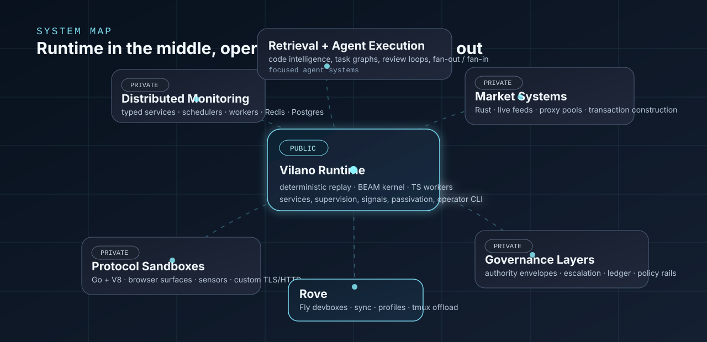

  

  <strong>Sam</strong> · CEO @ <a href="https://vilano.ai">Vilano AI</a> 
  building durable runtime, agent orchestration, and operator systems

## What I'm Building

The center of gravity is <a href="https://github.com/vilano-ai/runtime"><strong>Vilano Runtime</strong></a>: a durable runtime for agent systems built around deterministic replay, a BEAM kernel, disposable TypeScript workers, and an operator CLI.

Most of my work sits in the same zone: long-running systems that have to survive crashes, keep their state straight, expose their reasoning, and stay operable under real failure instead of just demo conditions.

  

## The Kind Of Systems I Build

- <strong>Durable agent runtime</strong> <a href="https://github.com/vilano-ai/runtime">public repo</a>: replay instead of retries, keyed services instead of ad hoc workers, supervision and passivation in the runtime itself, and operator tooling that can actually explain what happened.
- <strong>Execution and governance layers for agents</strong>: systems that turn work into explicit graphs, route decisions through authority boundaries, log decisions to a ledger, and make escalation a first-class primitive instead of a prompt hack.
- <strong>Retrieval and code intelligence systems</strong>: polyglot parsing, graph + vector representations of large codebases, citation-backed synthesis, and confidence gating so the system knows when not to bluff.
- <strong>Distributed operator systems</strong>: scheduler/worker/storage splits, typed service boundaries, durable state transitions, and control loops designed to keep running while the world is noisy.
- <strong>Protocol and browser simulation tooling</strong>: reconstructing browser surfaces, sensors, cookies, event timing, and network fingerprints closely enough to execute hostile or brittle web logic inside a controlled sandbox.
- <strong>Market-facing low-latency systems</strong>: real-time feed monitoring, ranking and floor analysis, proxy-aware client pools, and transaction construction paths that can go all the way from signal to action.
- <strong>Personal operator tooling</strong> <a href="https://github.com/mcl0vinit/rove">public repo</a>: remote devboxes, repo sync, profile bootstrap, tmux offload, and clean pullback for multi-machine work.

## Themes I Keep Returning To

- deterministic recovery over best-effort retries
- queues, leases, supervision, and state machines made explicit
- agent systems that can be inspected, paused, resumed, and debugged
- hard boundaries between execution, policy, and operator control
- local-first tools with real operational surfaces
- protocol, browser, and systems internals when abstraction stops helping

## Public Things To Look At

- <a href="https://github.com/vilano-ai/runtime">vilano-ai/runtime</a>
- <a href="https://github.com/mcl0vinit/rove">mcl0vinit/rove</a>
